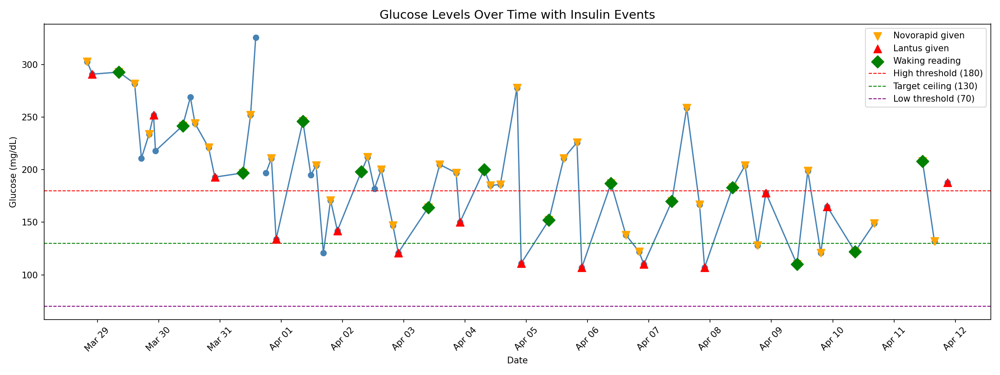
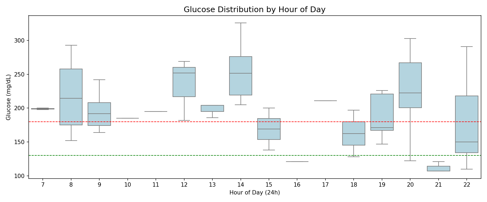
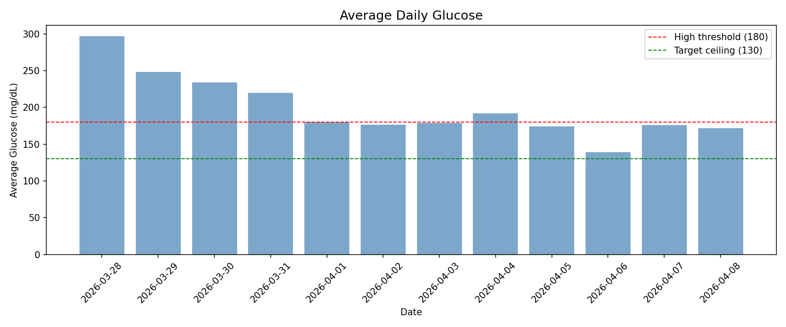
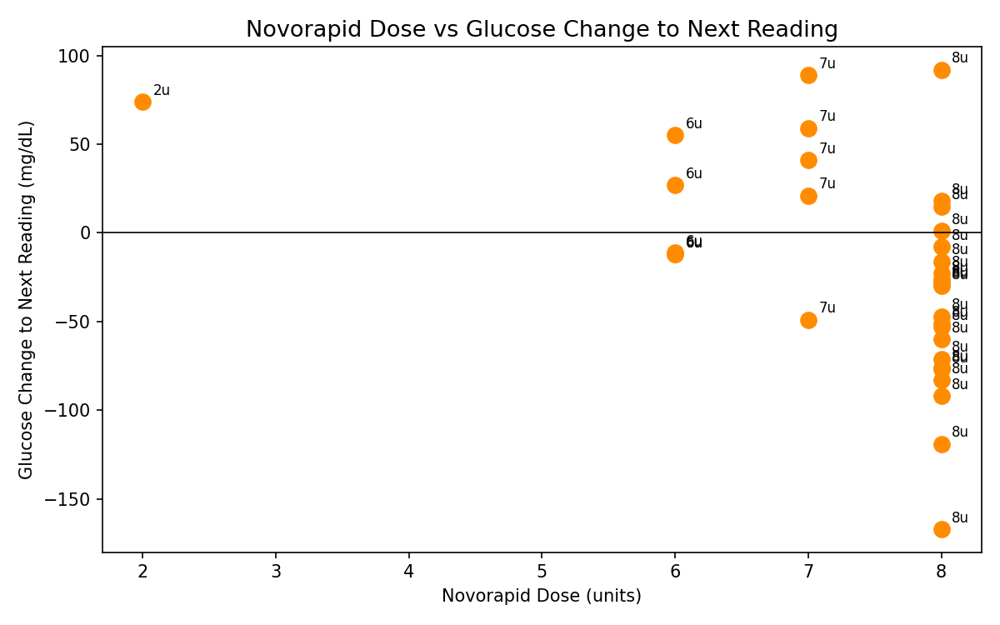

# Glucose Analytics

Personal glucose pattern analysis and insulin response tracker built to support
management of a Type 2 diabetic patient's insulin therapy over a 12-day period (more updates later).

Ingested manual clinical data, identified the dawn phenomenon pattern, and analyzed
behavioral and pharmacological factors affecting fasting glucose levels.

---

## Data

- 56 readings across 12 days (Mar 28 – Apr 8, 2026)
- 4–7 readings per day
- Two insulin types tracked: Novorapid (pre-meal) and Lantus (basal, nightly)
- Waking readings flagged separately as primary clinical target

---

## Plots

### Glucose Timeline

Full 12-day glucose trace with insulin events and clinical thresholds overlaid.
Orange downward triangles mark Novorapid injections. Red upward triangles mark
Lantus injections. Green diamonds mark first waking readings of each day.
Dashed lines indicate hyperglycemia threshold (180), target ceiling (130),
and hypoglycemia threshold (70).

---

### Hourly Distribution

Boxplot grouping all readings by hour of day. Reveals which hours consistently
produce high or volatile glucose levels. Elevated and wide boxes in early morning
hours (7–9) confirm the dawn phenomenon; cortisol and adrenaline raise glucose
overnight independently of evening insulin.

---

### Daily Average

Mean glucose per day across the full observation period. Smooths out intra-day
noise to show the overall management trend. Bars above 180 indicate days where
average glucose remained in hyperglycemic range throughout the day.

---

### Insulin Response

Each dot represents one Novorapid injection. X axis is dose in units, Y axis is
glucose change to the next reading. Dots below zero indicate the injection
successfully lowered glucose. Dots above zero indicate glucose continued rising
despite the injection. Wide vertical spread at the same dose confirms inconsistent
insulin response likely driven by variable meal size, injection timing, and
physiological factors including active inflammation.

---

## Stack

- Python 3.12
- pandas — data loading and transformation
- matplotlib — plotting
- seaborn — statistical visualization
- scikit-learn — model (upcoming)
